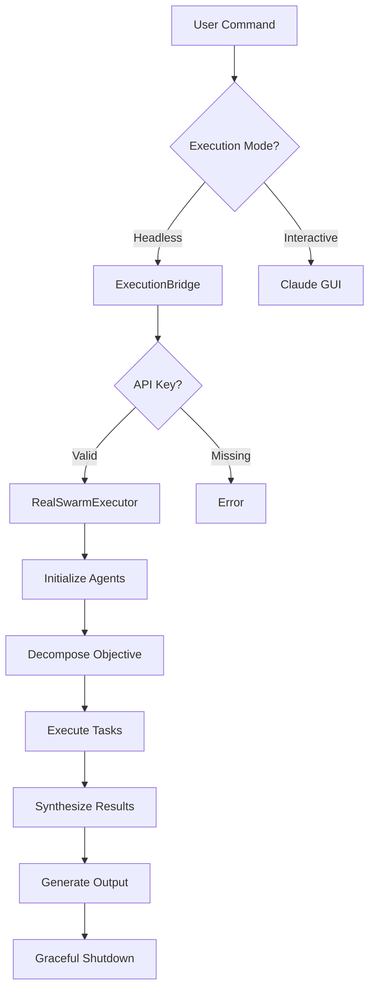

# Real Swarm Execution Documentation

## Table of Contents
1. [Overview](#overview)
2. [Architecture](#architecture)
3. [Setup & Configuration](#setup--configuration)
4. [Basic Usage](#basic-usage)
5. [Advanced Features](#advanced-features)
6. [API Reference](#api-reference)
7. [Deployment Guide](#deployment-guide)
8. [Performance & Cost](#performance--cost)
9. [Troubleshooting](#troubleshooting)
10. [Examples](#examples)

## Overview

Claude-Flow's Real Swarm Execution system orchestrates multiple AI agents to accomplish complex tasks through actual Claude API calls. Unlike mock execution, this system produces genuine AI-generated results through intelligent task decomposition, parallel execution, and result synthesis.

### Key Features
- **Real AI Execution**: Makes actual Claude API calls for authentic results
- **Multi-Agent Orchestration**: Coordinates specialized agents with unique personalities
- **Intelligent Task Decomposition**: Automatically breaks down objectives into manageable tasks
- **Parallel Processing**: Executes multiple tasks concurrently with rate limiting
- **Headless Support**: Works in containerized and CI/CD environments
- **Graceful Shutdown**: Clean process termination without hanging
- **Cost Tracking**: Monitors token usage and estimates costs

## Architecture

### System Components

```
┌─────────────────────────────────────────────────────────────┐
│                     CLI Entry Point                          │
│                  (swarm.js command)                          │
└─────────────────────┬───────────────────────────────────────┘
                      │
┌─────────────────────▼───────────────────────────────────────┐
│                  ExecutionBridge                             │
│              (execution-bridge.js)                           │
│  • Routes between execution modes                            │
│  • Manages headless detection                                │
│  • Handles graceful shutdown                                 │
└─────────────────────┬───────────────────────────────────────┘
                      │
┌─────────────────────▼───────────────────────────────────────┐
│               RealSwarmExecutor                              │
│            (real-swarm-executor.js)                          │
│  • Orchestrates multi-phase execution                        │
│  • Manages agent lifecycle                                   │
│  • Handles task distribution                                 │
└─────────────────────┬───────────────────────────────────────┘
                      │
┌─────────────────────▼───────────────────────────────────────┐
│              ClaudeAPIExecutor                               │
│           (claude-api-executor.js)                           │
│  • Makes Claude API calls                                    │
│  • Manages rate limiting                                     │
│  • Tracks token usage                                        │
└─────────────────────────────────────────────────────────────┘
```

### Execution Flow



## Setup & Configuration

### Prerequisites

1. **Node.js 18+**
   ```bash
   node --version  # Should be v18.0.0 or higher
   ```

2. **Anthropic API Key**
   ```bash
   # Get from https://console.anthropic.com/
   export ANTHROPIC_API_KEY=sk-ant-api03-...
   ```

3. **Claude-Flow Installation**
   ```bash
   npm install -g claude-flow@latest
   # Or use locally
   npx claude-flow --version
   ```

### Configuration Options

#### Environment Variables
```bash
# Required
ANTHROPIC_API_KEY=sk-ant-api03-...

# Optional
CLAUDE_FLOW_HEADLESS=true              # Force headless mode
CLAUDE_FLOW_EXIT_ON_COMPLETE=true      # Exit after completion
CLAUDE_API_ENDPOINT=https://...        # Custom API endpoint
CLAUDE_MODEL=claude-3-5-sonnet-20241022 # Model selection
CLAUDE_FLOW_BATCH_SIZE=3               # API call batch size
CLAUDE_FLOW_RATE_LIMIT_DELAY=2000      # Delay between batches (ms)
```

#### Configuration File (.env)
```ini
# .env file in project root
ANTHROPIC_API_KEY=sk-ant-api03-...
CLAUDE_FLOW_HEADLESS=true
CLAUDE_MODEL=claude-3-5-sonnet-20241022
```

## Basic Usage

### Simple Execution
```bash
# Basic swarm with auto strategy
claude-flow swarm "Create a REST API for user management" --executor

# Research strategy
claude-flow swarm "Research AI trends in healthcare" --strategy research --executor

# Development strategy
claude-flow swarm "Build authentication system" --strategy development --executor
```

### Output Structure
```
./swarm-runs/
└── exec_[id]/
    └── swarm_[id]/
        ├── summary.json    # Metadata and overview
        ├── results.json    # Detailed API responses
        └── report.md       # Human-readable report
```

### Strategies

| Strategy | Agents | Best For | Token Usage |
|----------|--------|----------|-------------|
| auto | 5 mixed | General tasks | Medium |
| development | 5 dev-focused | Coding tasks | High |
| research | 3 research | Analysis tasks | Medium |
| analysis | 3 analyst | Data tasks | Low |

## Advanced Features

### 1. Headless Execution

#### Docker
```dockerfile
FROM node:18-slim
WORKDIR /app
COPY package*.json ./
RUN npm install
COPY . .

ENV ANTHROPIC_API_KEY=${ANTHROPIC_API_KEY}
ENV CLAUDE_FLOW_HEADLESS=true

ENTRYPOINT ["npx", "claude-flow", "swarm"]
CMD ["--executor"]
```

```bash
# Run container
docker run -e ANTHROPIC_API_KEY=$ANTHROPIC_API_KEY \
  -v $(pwd)/output:/app/swarm-runs \
  claude-flow:latest \
  "Analyze security vulnerabilities" --executor
```

#### AWS Batch
```json
{
  "jobDefinitionName": "claude-flow-swarm",
  "type": "container",
  "containerProperties": {
    "image": "your-ecr-repo/claude-flow:latest",
    "vcpus": 2,
    "memory": 4096,
    "environment": [
      {"name": "CLAUDE_FLOW_HEADLESS", "value": "true"},
      {"name": "ANTHROPIC_API_KEY", "value": "SECRET_ARN"}
    ],
    "command": ["swarm", "OBJECTIVE", "--executor"]
  }
}
```

### 2. Parallel Execution Control

```bash
# Limit concurrent agents
claude-flow swarm "Complex task" --max-agents 3 --executor

# Set custom timeout (in minutes)
claude-flow swarm "Long running task" --timeout 10 --executor

# Control batch size via environment
export CLAUDE_FLOW_BATCH_SIZE=2
claude-flow swarm "Rate limited task" --executor
```

### 3. Output Formats

```bash
# JSON output for automation
claude-flow swarm "Task" --executor --output-format json > result.json

# Save to specific file
claude-flow swarm "Task" --executor --output-file report.md

# Non-interactive mode
claude-flow swarm "Task" --executor --no-interactive
```

### 4. Custom Agent Configuration

```javascript
// Custom executor configuration
import { RealSwarmExecutor } from 'claude-flow/headless';

const executor = new RealSwarmExecutor({
  apiKey: process.env.ANTHROPIC_API_KEY,
  strategy: 'custom',
  agents: [
    { name: 'Architect', type: 'architect', personality: 'systematic' },
    { name: 'Engineer', type: 'developer', personality: 'pragmatic' },
    { name: 'Reviewer', type: 'tester', personality: 'critical' }
  ],
  maxConcurrent: 2,
  batchSize: 2,
  rateLimitDelay: 3000
});

const result = await executor.execute('Build microservice');
```

## API Reference

### ExecutionBridge

```javascript
class ExecutionBridge {
  constructor(config?: {
    headless?: boolean;
    claudeApiKey?: string;
    claudeApiEndpoint?: string;
    maxAgents?: number;
    timeout?: number;
    exitOnComplete?: boolean;
  });

  executeSwarm(
    objective: string,
    flags?: {
      strategy?: string;
      mode?: string;
      headless?: boolean;
      executor?: boolean;
      mock?: boolean;
      'max-agents'?: number;
      timeout?: number;
    }
  ): Promise<ExecutionResult>;
}
```

### RealSwarmExecutor

```javascript
class RealSwarmExecutor {
  constructor(config?: {
    apiKey: string;
    strategy?: 'auto' | 'development' | 'research' | 'analysis';
    maxAgents?: number;
    outputDir?: string;
    batchSize?: number;
    rateLimitDelay?: number;
    maxRetries?: number;
  });

  execute(objective: string): Promise<SwarmResult>;
  
  initializeAgents(): Promise<Agent[]>;
  decomposeObjective(objective: string): Promise<Task[]>;
  executeTasks(): Promise<TaskResult[]>;
  synthesizeResults(objective: string): Promise<string>;
}
```

### ClaudeAPIExecutor

```javascript
class ClaudeAPIExecutor {
  constructor(config?: {
    apiKey: string;
    apiEndpoint?: string;
    model?: string;
    maxTokens?: number;
    temperature?: number;
  });

  callClaudeAPI(prompt: string): Promise<APIResponse>;
  executeTask(task: Task, agent: Agent): Promise<TaskResult>;
}
```

### Type Definitions

```typescript
interface ExecutionResult {
  success: boolean;
  mode: 'headless-api' | 'interactive' | 'mock';
  swarmId: string;
  objective: string;
  duration: number;
  agents: number;
  tasks: number;
  results: {
    status: string;
    output: string;
    artifacts: {
      outputDirectory: string;
      files: string[];
      taskResults: TaskResult[];
    };
  };
}

interface SwarmResult {
  success: boolean;
  swarmId: string;
  objective: string;
  strategy: string;
  duration: number;
  agents: number;
  tasks: number;
  synthesis: string;
  results: TaskResult[];
  output: {
    directory: string;
    files: OutputFile[];
  };
}

interface Task {
  id: string;
  description: string;
  status: 'pending' | 'in-progress' | 'completed' | 'failed';
  assignedAgent?: string;
}

interface Agent {
  id: string;
  name: string;
  type: 'coordinator' | 'architect' | 'developer' | 'analyst' | 'tester' | 'researcher';
  personality?: string;
}

interface TaskResult {
  taskId: string;
  agentId: string;
  output: string;
  duration: number;
  tokensUsed: number;
  success: boolean;
}
```

## Deployment Guide

### 1. Docker Deployment

```dockerfile
# Dockerfile
FROM node:18-alpine

# Install dependencies
RUN apk add --no-cache git

# Create app directory
WORKDIR /app

# Copy package files
COPY package*.json ./

# Install dependencies
RUN npm ci --only=production

# Copy application
COPY . .

# Set environment
ENV NODE_ENV=production
ENV CLAUDE_FLOW_HEADLESS=true

# Create output directory
RUN mkdir -p /app/swarm-runs

# Run as non-root user
USER node

# Entry point
ENTRYPOINT ["node", "bin/claude-flow.js", "swarm"]
```

```bash
# Build and run
docker build -t claude-flow-executor .
docker run \
  -e ANTHROPIC_API_KEY=$ANTHROPIC_API_KEY \
  -v $(pwd)/output:/app/swarm-runs \
  claude-flow-executor \
  "Your objective here" --executor
```

### 2. Kubernetes Deployment

```yaml
apiVersion: batch/v1
kind: Job
metadata:
  name: claude-flow-swarm
spec:
  template:
    spec:
      containers:
      - name: executor
        image: your-registry/claude-flow:latest
        env:
        - name: ANTHROPIC_API_KEY
          valueFrom:
            secretKeyRef:
              name: claude-secrets
              key: api-key
        - name: CLAUDE_FLOW_HEADLESS
          value: "true"
        args:
        - "Research kubernetes best practices"
        - "--executor"
        - "--strategy"
        - "research"
        volumeMounts:
        - name: output
          mountPath: /app/swarm-runs
      volumes:
      - name: output
        persistentVolumeClaim:
          claimName: swarm-output-pvc
      restartPolicy: Never
```

### 3. GitHub Actions

```yaml
name: AI Swarm Analysis

on:
  pull_request:
    types: [opened, synchronize]

jobs:
  analyze:
    runs-on: ubuntu-latest
    steps:
      - uses: actions/checkout@v3
      
      - name: Setup Node.js
        uses: actions/setup-node@v3
        with:
          node-version: '18'
      
      - name: Install Claude-Flow
        run: npm install -g claude-flow@latest
      
      - name: Run Security Analysis
        env:
          ANTHROPIC_API_KEY: ${{ secrets.ANTHROPIC_API_KEY }}
        run: |
          claude-flow swarm \
            "Analyze security vulnerabilities in this PR" \
            --strategy analysis \
            --executor \
            --output-format json > analysis.json
      
      - name: Comment PR
        uses: actions/github-script@v6
        with:
          script: |
            const fs = require('fs');
            const analysis = JSON.parse(fs.readFileSync('analysis.json'));
            github.rest.issues.createComment({
              ...context.repo,
              issue_number: context.issue.number,
              body: `## AI Security Analysis\n\n${analysis.synthesis}`
            });
```

### 4. AWS Lambda

```javascript
// handler.js
import { RealSwarmExecutor } from 'claude-flow/headless';

export async function handler(event) {
  const { objective, strategy = 'auto' } = event;
  
  const executor = new RealSwarmExecutor({
    apiKey: process.env.ANTHROPIC_API_KEY,
    strategy,
    outputDir: '/tmp/swarm-output'
  });
  
  try {
    const result = await executor.execute(objective);
    
    // Upload to S3
    const s3Key = `swarm-runs/${result.swarmId}/`;
    await uploadToS3(result.output.directory, s3Key);
    
    return {
      statusCode: 200,
      body: JSON.stringify({
        success: true,
        swarmId: result.swarmId,
        duration: result.duration,
        outputUrl: `s3://bucket/${s3Key}`,
        synthesis: result.synthesis
      })
    };
  } catch (error) {
    return {
      statusCode: 500,
      body: JSON.stringify({
        success: false,
        error: error.message
      })
    };
  }
}
```

## Performance & Cost

### Token Usage by Task Complexity

| Complexity | Example | Agents | Tasks | Tokens | Cost | Duration |
|------------|---------|--------|-------|--------|------|----------|
| Simple | "Hello World" | 5 | 5 | 2,000-3,000 | $0.02-0.03 | 20-30s |
| Medium | "REST API" | 5 | 6-8 | 8,000-12,000 | $0.08-0.12 | 40-60s |
| Complex | "Research Analysis" | 3-5 | 6-10 | 15,000-25,000 | $0.15-0.25 | 60-90s |
| Advanced | "Full System Design" | 5-8 | 10-15 | 30,000-50,000 | $0.30-0.50 | 90-120s |

### Performance Optimization

```javascript
// Optimize for cost
const executor = new RealSwarmExecutor({
  apiKey: process.env.ANTHROPIC_API_KEY,
  maxAgents: 3,           // Fewer agents
  batchSize: 2,           // Smaller batches
  maxTokens: 512,         // Limit response size
  temperature: 0.5        // More focused responses
});

// Optimize for speed
const executor = new RealSwarmExecutor({
  apiKey: process.env.ANTHROPIC_API_KEY,
  maxAgents: 8,           // More agents
  batchSize: 5,           // Larger batches
  rateLimitDelay: 1000,   // Shorter delays
  maxConcurrent: 5        // Higher concurrency
});

// Optimize for quality
const executor = new RealSwarmExecutor({
  apiKey: process.env.ANTHROPIC_API_KEY,
  maxAgents: 5,           // Balanced agents
  maxTokens: 2048,        // Detailed responses
  temperature: 0.7,       // Creative responses
  maxRetries: 3           // Retry on failures
});
```

### Cost Management

```bash
# Set token limits
export CLAUDE_FLOW_MAX_TOKENS=1000
export CLAUDE_FLOW_MAX_TOTAL_TOKENS=10000

# Monitor usage
claude-flow swarm "Task" --executor --dry-run  # Preview without execution
claude-flow swarm "Task" --executor --verbose   # Detailed token tracking
```

## Troubleshooting

### Common Issues

#### 1. API Key Not Found
```bash
# Error
❌ Error: Real agent execution requires a valid ANTHROPIC_API_KEY

# Solutions
export ANTHROPIC_API_KEY=sk-ant-api03-...
# OR
echo "ANTHROPIC_API_KEY=sk-ant-api03-..." >> .env
source .env
# OR
ANTHROPIC_API_KEY=sk-ant-api03-... claude-flow swarm "task" --executor
```

#### 2. Rate Limit Errors
```bash
# Error
❌ Error: Claude API error: 429 - Rate limit exceeded

# Solutions
# Increase delay
export CLAUDE_FLOW_RATE_LIMIT_DELAY=5000

# Reduce batch size
export CLAUDE_FLOW_BATCH_SIZE=2

# Limit agents
claude-flow swarm "task" --max-agents 3 --executor
```

#### 3. Timeout Issues
```bash
# Error
❌ Error: Swarm execution timed out

# Solutions
# Increase timeout (minutes)
claude-flow swarm "task" --timeout 15 --executor

# Simplify objective
claude-flow swarm "build user auth" --executor  # Instead of complex description

# Use appropriate strategy
claude-flow swarm "research task" --strategy research --executor
```

#### 4. Network Issues
```bash
# Error
❌ Error: fetch failed

# Solutions
# Check connectivity
curl -I https://api.anthropic.com

# Use proxy if needed
export HTTPS_PROXY=http://proxy:port

# Retry with backoff
claude-flow swarm "task" --executor --max-retries 5
```

### Debug Mode

```bash
# Enable verbose logging
export DEBUG=claude-flow:*
claude-flow swarm "task" --executor --verbose

# Dry run to preview
claude-flow swarm "task" --executor --dry-run

# Save debug logs
claude-flow swarm "task" --executor --verbose 2>&1 | tee debug.log
```

## Examples

### 1. Development Task
```bash
# Build a complete feature
claude-flow swarm \
  "Build a user authentication system with JWT tokens, password reset, and email verification" \
  --strategy development \
  --executor

# Output includes:
# - System architecture design
# - Database schema
# - API endpoints
# - Implementation code
# - Test cases
# - Security considerations
```

### 2. Research Task
```bash
# Comprehensive research
claude-flow swarm \
  "Research and compare top 5 cloud providers for ML workloads including pricing, features, and performance" \
  --strategy research \
  --executor \
  --output-file cloud-ml-comparison.md
```

### 3. Analysis Task
```bash
# Code analysis
claude-flow swarm \
  "Analyze this codebase for security vulnerabilities, performance issues, and architectural improvements" \
  --strategy analysis \
  --executor \
  --output-format json | jq '.synthesis'
```

### 4. Batch Processing
```bash
#!/bin/bash
# batch-swarm.sh

objectives=(
  "Design user authentication system"
  "Create API documentation"
  "Write test suite"
  "Implement monitoring"
)

for objective in "${objectives[@]}"; do
  echo "Processing: $objective"
  claude-flow swarm "$objective" \
    --executor \
    --strategy development \
    --output-file "output/${objective//[^a-zA-Z0-9]/_}.md"
  sleep 30  # Rate limiting
done
```

### 5. CI/CD Integration
```yaml
# .github/workflows/ai-review.yml
name: AI Code Review

on: [pull_request]

jobs:
  review:
    runs-on: ubuntu-latest
    steps:
      - uses: actions/checkout@v3
      
      - name: AI Review
        env:
          ANTHROPIC_API_KEY: ${{ secrets.ANTHROPIC_API_KEY }}
        run: |
          npx claude-flow swarm \
            "Review code changes for bugs, security issues, and improvements" \
            --strategy analysis \
            --executor \
            --output-format json > review.json
      
      - name: Post Review
        uses: actions/github-script@v6
        with:
          script: |
            const review = require('./review.json');
            await github.rest.pulls.createReview({
              ...context.repo,
              pull_number: context.issue.number,
              body: review.synthesis,
              event: 'COMMENT'
            });
```

## Best Practices

### 1. Objective Writing
```bash
# ❌ Too vague
claude-flow swarm "build app" --executor

# ✅ Specific and actionable
claude-flow swarm \
  "Build a React Native mobile app for task management with offline support, push notifications, and cloud sync" \
  --executor
```

### 2. Strategy Selection
```bash
# Development tasks
--strategy development  # For coding, building features

# Research tasks
--strategy research     # For analysis, comparisons, investigations

# Analysis tasks
--strategy analysis     # For code review, optimization, audits

# Auto (default)
# Let the system choose based on objective
```

### 3. Cost Control
```bash
# Preview execution
claude-flow swarm "objective" --executor --dry-run

# Limit scope
claude-flow swarm "objective" --max-agents 3 --executor

# Monitor usage
claude-flow swarm "objective" --executor --verbose 2>&1 | \
  grep "Tokens used" | \
  awk '{sum+=$3} END {print "Total tokens:", sum}'
```

### 4. Output Management
```bash
# Organize outputs by date
OUTPUT_DIR="swarm-runs/$(date +%Y-%m-%d)"
mkdir -p $OUTPUT_DIR

# Execute with custom output
claude-flow swarm "objective" \
  --executor \
  --output-file "$OUTPUT_DIR/report.md"

# Archive old runs
find swarm-runs -type d -mtime +30 -exec tar -czf {}.tar.gz {} \;
```

### 5. Error Handling
```bash
#!/bin/bash
# safe-swarm.sh

set -euo pipefail

# Check prerequisites
if [[ -z "${ANTHROPIC_API_KEY:-}" ]]; then
  echo "Error: ANTHROPIC_API_KEY not set"
  exit 1
fi

# Execute with error handling
if claude-flow swarm "$1" --executor; then
  echo "Success!"
  # Process output
else
  echo "Failed with exit code $?"
  # Handle failure
fi
```

## Security Considerations

### 1. API Key Management
```bash
# Never commit keys
echo "ANTHROPIC_API_KEY" >> .gitignore

# Use environment variables
export ANTHROPIC_API_KEY=$(aws secretsmanager get-secret-value \
  --secret-id claude-api-key \
  --query SecretString --output text)

# Rotate regularly
# Set up key rotation in your secret management system
```

### 2. Output Sanitization
```javascript
// Sanitize outputs before storage
const sanitizeOutput = (output) => {
  // Remove potential secrets
  return output
    .replace(/sk-ant-api\d+[-\w]+/g, '[REDACTED]')
    .replace(/password["']?\s*[:=]\s*["']?[\w]+/gi, 'password: [REDACTED]')
    .replace(/\b\d{4}[\s-]?\d{4}[\s-]?\d{4}[\s-]?\d{4}\b/g, '[CARD]');
};
```

### 3. Network Security
```bash
# Use HTTPS proxy
export HTTPS_PROXY=https://secure-proxy:443

# Verify SSL
export NODE_TLS_REJECT_UNAUTHORIZED=1

# Restrict API endpoint
export CLAUDE_API_ENDPOINT=https://api.anthropic.com/v1/messages
```

## Migration Guide

### From Mock to Real Execution
```bash
# Old (mock execution)
claude-flow swarm "objective"

# New (real execution)
claude-flow swarm "objective" --executor

# With API key
ANTHROPIC_API_KEY=sk-ant-api03-... claude-flow swarm "objective" --executor
```

### From Interactive to Headless
```bash
# Interactive (old)
claude-flow swarm "objective"  # Opens Claude GUI

# Headless (new)
CLAUDE_FLOW_HEADLESS=true claude-flow swarm "objective" --executor

# Docker/CI automatically uses headless
docker run claude-flow "objective" --executor
```

## Support & Resources

- **Documentation**: https://github.com/ruvnet/claude-flow/docs
- **Issues**: https://github.com/anthropics/claude-flow/issues
- **API Status**: https://status.anthropic.com
- **API Docs**: https://docs.anthropic.com/claude/reference

## Conclusion

The Real Swarm Execution system transforms Claude-Flow into a powerful AI orchestration platform capable of handling complex, multi-faceted objectives through intelligent agent coordination. With proper configuration and usage, it provides a cost-effective, scalable solution for AI-powered automation in development, research, and analysis workflows.